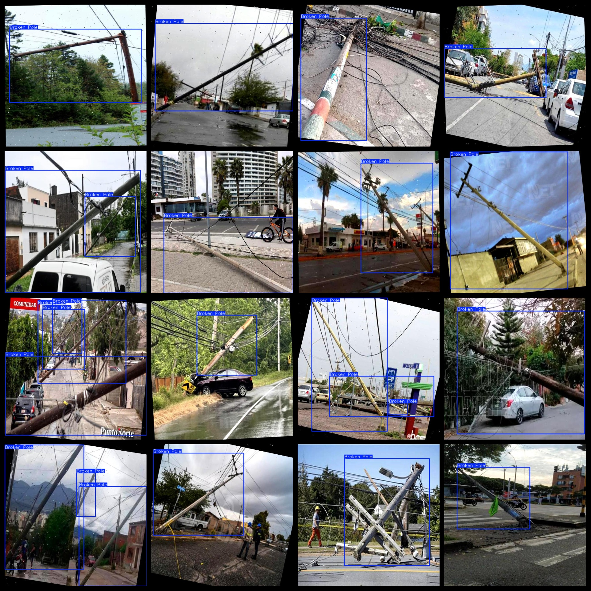

# Damaged right of privacy Utility Pole Dataset 7503 imagesVOC+YOLO format（ In (Augmented) ）

Damaged utility pole dataset 7503 sheets in VOC + YOLO format (for enhancement)

Dataset format: Pascal VOC format + YOLO format (the txt file does not contain the split path, it only contains jpg images and corresponding VOC format xml files and yolo format txt files)

Number of images (total number of jpg files): 7503

Number of xml files: 7503

Number of txt files: 7503

Number of categories: 1

The Github repository is: datasets_sl

Category Name: ["Broken Pole"]

Number of boxes labeled in each category:

Broken Pole Frame Number = 9198

Total frame count: 9198

Number of images per category:

Broken Pole owns 7503 photos.

Image resolution: 640x640

Use the labeling tool: labelImg

Dataset is enhanced: Yes (high proportion, less than 300 actual images enhanced).

Rules for annotation: Draw a rectangle around the category.

Important Note 05: The dataset must be split into training, validation, and test sets before use.

Special Disclaimer: This dataset does not guarantee the accuracy of the trained models or weight files.

Annotation and image details are as follows:

## Images

---

Here is a pay link on Stripe (https://buy.stripe.com/3cs8yP7sY87d0vu9AB). Please contact me lonlonago@foxmail.com after funding $89, and I will send you a complete data files, thank you!

